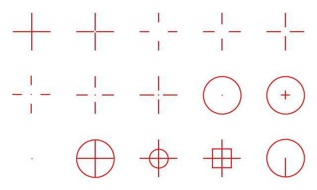

# Fadenkreuz

`Fadenkreuz` (German for `crosshairs`) is a simple and lightweight free open-source crosshairs application for Windows.

It was developed for using it with [Fortnite](https://www.fortnite.com/), but it should also work with other Windows games using DirectX 12 fullscreen or windowed mode.

**Warning**: Depending on the games you play, using a third-party crosshairs app like `Fadenkreuz` drawing an overlay (layered window) above other application windows may be considered as cheating and get you banned.

`Fadenkreuz` currently supports the following crosshairs shapes, whose size and color can be simply changed using hotkeys.




## Installation

For installing `Fadenkreuz`, you only need to copy a provided release version of `Fadenkreuz.exe` to your Windows system. That's it. 


## Build process

If you want to build `Fadenkreuz` from source code, you can do this, for example, by using the software distribution and building platform [MSYS2](https://www.msys2.org/), and the provided batch file `makeit.bat`. You may have to change paths to the used build tools `gcc.exe` and `windres.exe` within `makeit.bat` depending or your Minimal GNU for Windows (MinGW) software installation.

The default `makeit.bat` is as follows:

```
REM Simple build batch file for Fadenkreuz

REM Paths to installed MinGW tools (e.g. MSYS2, https://www.msys2.org/)
set GCC="C:\msys64\ucrt64\bin\gcc.exe"
set WINDRES="C:\msys64\ucrt64\bin\windres.exe"

%WINDRES% -i fadenkreuz.rc -O coff fadenkreuz.res
%GCC% -fdiagnostics-color=always -municode -s -O3 fadenkreuz.cpp fadenkreuz.res -mwindows -lgdi32 -luser32 -o Fadenkreuz.exe
```


## Usage

Start `Fadenkreuz.exe` on your Windows system.

You can control `Fadenkreuz` using the following hotkeys.

| Hotkey            | Functionality                             |
| ----------------- | ----------------------------------------- |
| \<F1\>            | Toggle crosshairs visibility              |
| \<F2\>            | Increase X-offset                         |
| \<CTRL\> + \<F2\> | Decrease X-offset                         |
| \<F3\>            | Increase Y-offset                         |
| \<CTRL\> + \<F3\> | Decrease Y-offset                         |
| \<F4\>            | Center crosshairs (reset offsets)         |
| \<F5\>            | Select next shape                         |
| \<CTRL\> + \<F5\> | Select previous shape                     |
| \<F6\>            | Select next color                         |
| \<CTRL\> + \<F6\> | Select previous color                     |
| \<F7\>            | Increase crosshairs size                  |
| \<CTRL\> + \<F7\> | Decrease crosshairs size                  |
| \<F8\>            | Increase crosshairs thickness             |
| \<CTRL\> + \<F8\> | Decrease crosshairs thickness             |
| \<F9\>            | Exit `Fadenkreuz` app                     |
| \<F10\>           | Load settings from Windows registry       |
| \<F11\>           | Save current settings to Windows registry |


## Operating mode

`Fadenkreuz` uses a layered window created with the flag `WS_EX_LAYERED` for showing the crosshairs, and updates its content using the Windows API method [UpdateLayeredWindow](https://learn.microsoft.com/en-us/windows/win32/api/winuser/nf-winuser-updatelayeredwindow). This layered window is periodically updated to the top window using the Windows API method [SetWindowPos](https://learn.microsoft.com/en-us/windows/win32/api/winuser/nf-winuser-setwindowpos).

The crosshairs are drawn using [GDI+](https://learn.microsoft.com/en-us/windows/win32/api/_gdiplus/) functionality provided by Windows.

Application settings are stored in the Windows registry key `HKEY_CURRENT_USER\Fadenkreuz`.


## Disclaimer

Use at your own risk.
